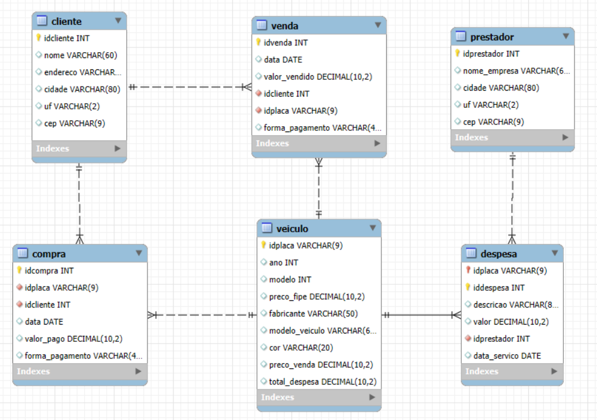

# Projeto de Gerenciamento de Vendas de Veículos e Serviços

Este projeto tem como objetivo desenvolver um sistema para gerenciar as operações de uma entidade que lida com a venda de veículos, compras de clientes, e despesas relacionadas a prestadores de serviços. O sistema permitirá o cadastro de clientes, veículos, prestadores de serviço, além do registro de transações de compra e venda, e o controle de despesas.

É um projeto destinado à disciplina de

## Diagrama do Banco de Dados

O diagrama entidade-relacionamento (DER) do banco de dados do projeto é o seguinte:



## Funcionalidades

- Cadastro, consulta, atualização e exclusão de Clientes.
- Cadastro, consulta, atualização e exclusão de Veículos.
- Cadastro, consulta, atualização e exclusão de Prestadores de Serviço.
- Registro de Vendas de veículos, associando cliente e veículo.
- Registro de Compras (de veículos ou outros itens/serviços), associando cliente e veículo.
- Registro de Despesas com serviços em veículos, associando prestador e veículo.
- Consultas e relatórios (ex: vendas por período, despesas por veículo, etc.).

## Tecnologias

O trabalho é desenvolvido em Flask, então necessita do Python para executá-lo, ademais, é utilizado o tailwind para geração de seu CSS, mas não é necessário instalar node, apenas se quiser mexer no projeto.

## Como Executar

1. Clone o projeto na sua máquina
2. Instale as dependências com `npm install` e `pip install -r requirements.txt`
3. Rode o projeto com `python3 app.py` ou `python app.py` dependendo da versão que possui do Python
4. Caso queira mudar as classes do tailwind, rode:

```bash
npx @tailwindcss/cli -i ./static/css/input.css -o ./static/css/output.css --watch
```

## Como Configurar o Banco de Dados com Docker

1. Certifique-se de que o Docker está instalado e em execução na sua máquina.
2. Suba o container do PostgreSQL com o seguinte comando:

```bash
docker compose up -d
```

3. Copie o arquivo `schema.sql` para dentro do container:

```bash
docker cp database/schema.sql market-flask-pg-1:/schema.sql
```

4. Acesse o container e execute o script SQL para criar as tabelas:

```bash
docker exec -it market-flask-pg-1 psql -U docker -d market-flask -f /schema.sql
```

5. Após configurar o banco de dados, você pode executar o projeto normalmente com:

```bash
python3 app.py
```

6. Para conectar ao banco via docker:

```bash
docker exec -it market-flask-pg-1 psql -U docker -d market-flask
```
